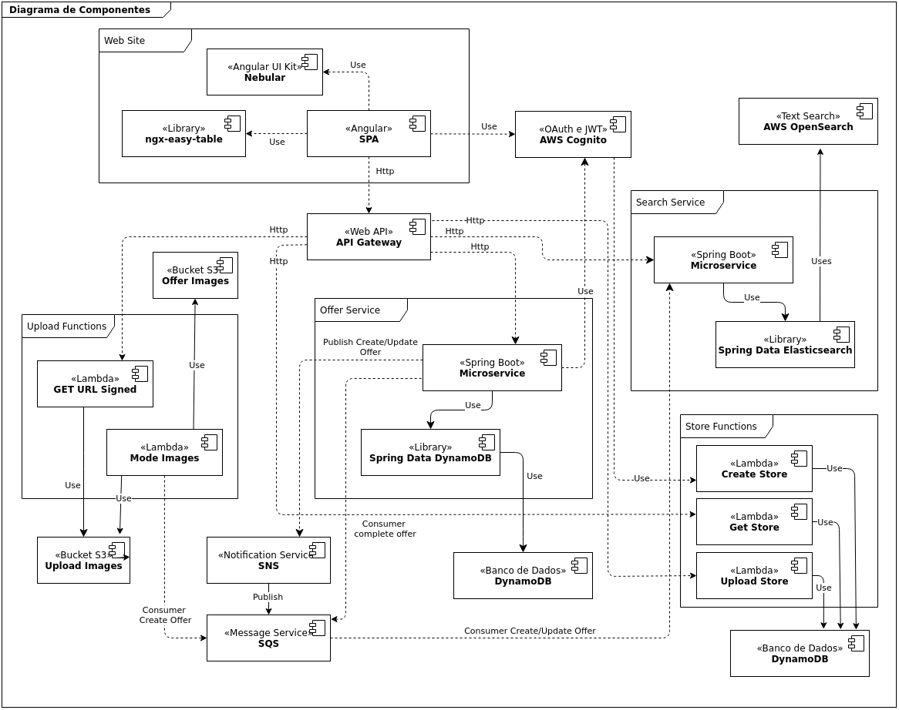

# Projeto Integrado - Offer – Sistema de Ofertas em Lojas Físicas

Esse repositório contendo documentos referente ao projeto de conclusão da pós graduação em arquitetura de software distribuído pela PUC Minas.

### Diagramas C4 Model

#### Contexto

Diagrama representando o contexto da aplicação Offer

#### Container

Diagrama representando os containers da aplicação Offer

#### Component

Diagrama representando os componentes da aplicação

